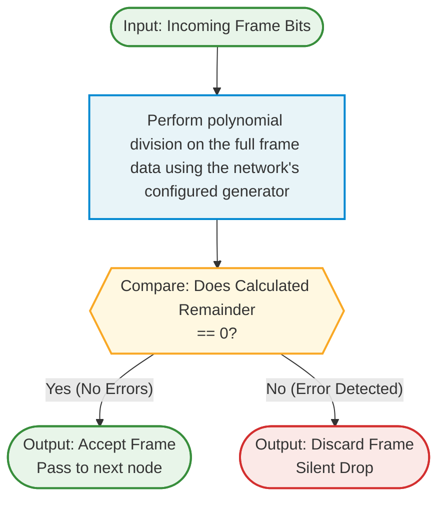

# Data Communication And Net-Centric Computing Group Assignment 2
---
## Group Member Details
#### Group No. 33:
Nikolas Papakalodoukas - s4094240
Alexandre Lee - s4090276
Thomas Gosling - s3850201
Jayden Bolth - s4104354

## Submission Checklist

| # | Requirement | Status | Double Checked / Verified |
|---|-------------|--------|---------------------------|
| 1 | Student names and IDs included | ✅ | |
| 2 | Student ID appended in every device name in Packet Tracer screenshots | ❌ | |
| 3 | Task A1: Two subnet designs with intuition (5 marks) | ✅ | |
| 4 | Task A1: Design comparison with advantages/disadvantages (2 marks) | ✅ | |
| 5 | Task A1: mod 2 student ID → last 8 bits → IP address (2 marks) | ✅ | |
| 6 | Task A2: Network configuration with all devices (3 marks) | ✅ | |
| 7 | Task A2: Sales server web app via TCP (3 marks) | ✅ | |
| 8 | Task A2: IT server UDP real-time service (3 marks) | ✅ | |
| 9 | Task A2: DNS query with domain name (2 marks) | ✅ | |
| 10 | Task A2: DNS packet monitoring at L2/L3/L4 (2 marks) | ✅ | |
| 11 | Task A2: Design choices explanation ≤250 words (2 marks) | ✅ | |
| 12 | Task B.1: FCS explanation with 3-5 steps and diagram (3 marks) | ✅ | |
| 13 | Task B.2: TCP/IP layer for FCS + integrity explanation (3 marks) | ✅ | |
| 14 | Task B.3: TCP vs UDP trade-off example (2 marks) | ✅ | |
| 15 | Task C: Clear structure, presentation, referencing (3 marks) | ✅ | |
| 16 | Group member contributions table included | ❌ | |

# Task A
Car Sales Melbourne City has recently relocated from Richmond. The company consists of four main departments: Marketing, Administration, IT, and Sales. Currently, each of Marketing, Administration and Sales departments has 40 staff, while the fast-growing IT department has 60 staff. Assume that the company has been assigned the IP address 192.100.30.0. As a networking engineer at Car Sales Melbourne City, your task is to design and implement a new private network for the company.

## Task A1: Designing Potential Subnets 1, 2, 3 and 4 for the Marketing, Administration, IT, and Sales Departments
### 1. Subnet Designs
(9 marks)
| Departments | Marketing | Administration | Sales | IT |
|---------|---------|---------|---------|---------|
| Requirements | 40 | 40 | 40 | 60 + fast growing |
 
1. (5 marks) Specifically, you need to provide two different designs and explain your intuitions behind.

### Subnet Design 1
Design 1 utilises a FSLM approach, subdividing the network into 4 subnets of equal size, using 26 bits for the network address and giving each subnetwork a total of 62 hosts each.

Since each department is provisioned with only 2 PCs by default, it is highly probable that Car Sales Melbourne City accommodates a BYOD (Bring Your Own Device) work environment, suggesting that staff will require IP addresses for multiple devices (e.g., laptop and smartphone). Because of this, Design 1 does not provide sufficient room for growth or a BYOD environment; with only 62 addresses per subnet and 40 staff per department, only 22 spare addresses remain. This is inadequate for the fast-growing IT department (which would have only 2 spare addresses) and cannot support multiple devices per person in a BYOD workplace.
| Subnet | Network Address | Usable IP Range | Broadcast Address | CIDR Prefix |
|---------|---------|---------|---------|---------|
|IT - Subnet 1|192.100.30.0|192.100.30.1-192.100.30.62|192.100.30.63|/26|
|Marketing - Subnet 2|192.100.30.64|192.100.30.65-192.100.30.126|192.100.30.127|/26|
|Administration - Subnet 3|192.100.30.128|192.100.30.129-192.100.30.190|192.100.30.191|/26|
|Sales - Subnet 4|192.100.30.192|192.100.30.193-192.100.30.254|192.100.30.255|/26|
### Subnet Design 2: Supernet Configuration

The IP address assigned to Car Sales Melbourne City, [`192.100.30.0`](https://www.ripe.net/publications/docs/ripe-504/), is a public Class C address belonging to RIPE NCC (Réseaux IP Européens Network Coordination Centre) (RIPE NCC, 2026). By default, a Class C address implies a `/24` subnet mask, providing 255 total addresses (254 usable). However, given the staffing requirements across all four departments, a total of 180 staff require network access: 60 staff in IT and 40 each in Marketing, Administration, and Sales. This represents approximately 70% utilisation of the 255 available addresses if one device per person is assumed.

Furthermore, RIPE NCC stipulates that 80% of a reasonable allocation must be utilised before additional allocations can be granted (RIPE NCC, 2026). The aforementioned BYOD environment justifies the 80% minimum requirement for additional allocation, as the actual address demand per person is likely to exceed one device.

Given these considerations, a /23 supernet (512 addresses) is necessary. However, even 512 addresses may not be sufficient to accommodate at least 2 devices per person (computer and phone) across all departments simultaneously. Therefore, additional measures such as IP address recycling (reclaiming addresses from less frequently used devices) will need to be employed to manage the address space efficiently.

To accommodate this, we must request permission from our ISP to supernet (i.e., obtain a larger CIDR block). RIPE NCC policy requires that at least 50% of the current allocation must be utilised within one year, otherwise the allocation may be downgraded (RIPE NCC, 2026b). Assuming two devices per person, the 70% utilisation threshold is comfortably exceeded, justifying the need for additional address space.

The supernet configuration is as follows:

| Department | Staff (Needed) | Allocated IPs | CIDR | Network Address | Usable Range | Broadcast Address |
|------------|---------------|---------------|------|----------------|--------------|-------------------|
| IT | 60 | 126 | /25 | 192.100.30.0 | 192.100.30.1 to .126 | 192.100.30.127 |
| Marketing | 40 | 62 | /26 | 192.100.30.128 | 192.100.30.129 to .190 | 192.100.30.191 |
| Admin | 40 | 62 | /26 | 192.100.30.192 | 192.100.30.193 to .254 | 192.100.30.255 |
| Sales | 40 | 62 | /26 | 192.100.31.0 | 192.100.31.1 to .62 | 192.100.31.63 |

This configuration allocates a `/25` (126 usable addresses) to the fast-growing IT department, providing ample room for expansion, while each of the remaining three departments receives a `/26` (62 usable addresses). The supernet spans from `192.100.30.0/23` to `192.100.31.255/23`, effectively aggregating the four subnets under a single supernet prefix.

### 2. Subnet Design Comparison: Analysing Advantages and Disadvantages of Each Subnet and Which is the Better Design in Your Opinion
| Design # | Advantages | Disadvantages |
|---------|---------|---------|
| Subnet Design 1 | Allows growth (of about 22 users) for Marketing, Admin & Sales; evenly spreads out the allocation per department | 'Fast Growing' IT department does not have much scalability, only having 2 free slots; completely unsuitable for a BYOD environment as the limited address space per subnet cannot accommodate multiple devices per person; definitively lacks capacity for organisational growth, meaning the IT department's 2 spare slots are exhausted immediately, and the 22 spare slots across the other three departments cannot cover even one additional device per staff member |
| Subnet Design 2 (Supernet) | IT department receives a /25 (126 addresses) with 66 spare slots for growth; Marketing, Admin, and Sales each receive a /26 (62 addresses) with 22 spare slots each; the /23 supernet (512 addresses) provides substantial headroom for BYOD; capable of supporting at least 2 devices per person across all departments; aligns with RIPE NCC utilisation policies for additional allocation | Requires ISP permission to supernet beyond the default /24; even 512 addresses may not be sufficient if every staff member uses more than 2 devices simultaneously, necessitating additional measures such as IP address recycling |

In my opinion, Subnet Design 2 (Supernet) is the superior choice. Design 1 is fundamentally flawed for this organisation because it allocates only 62 addresses per subnet, leaving the IT department with a mere 2 spare addresses and the other departments with 22 each. This is completely inadequate for a BYOD work environment, as even one additional device per person would immediately exhaust the IT subnet and severely strain the others. Design 1 therefore definitively fails to meet the organisation's current needs, let alone future growth, and is not a viable option.

In contrast, Design 2's supernet approach leverages a /23 block (512 addresses) obtained through ISP permission, justified by the 70% utilisation of the original /24 and the BYOD-driven demand for multiple devices per person. The IT department receives a /25 (126 addresses and 66 spare), while Marketing, Admin, and Sales each receive a /26 (62 addresses and 22 spare each). This configuration provides ample room for departmental growth and comfortably supports at least 2 devices per staff member. Furthermore, it aligns with RIPE NCC's 50% minimum utilisation policy (RIPE NCC, 2026b) and the 80% utilisation threshold for additional allocations (RIPE NCC, 2026b). While even 512 addresses may require IP address recycling for full 2-device-per-person coverage, Design 2 is the only option that provides a realistic and scalable foundation for a modern BYOD-enabled workplace.

### 3. Deciding the IP Address for Host and Departments via Calculating the Last 8 Bits from a Mod 2 Operation of Nikolas' Student ID
###### Goal: Nikolas' student ID: s4094240, converted to 4094240, then mod 2

Step 1: 4094240 mod 2 = 0, 2047120 \
Step 2: 2047120 mod 2 = 0, 1023560 \
Step 3: 1023560 mod 2 = 0, 511780 \
Step 4: 511780 mod 2 = 0, 255890 \
Step 5: 255890 mod 2 = 0, 127945 \
Step 6: 127945 mod 2 = 1, 63972 \
Step 7: 63972 mod 2 = 0, 31986 \
Step 8: 31986 mod 2 = 0, 15993 \
The first bit calculated is the least significant bit \
First 8 bits: 0 0 1 0 0 0 0 0 = 32

IP address: 192.100.30.32

192.100.30.32 falls within the IT department subnet (192.100.30.0/25), which has usable hosts ranging from 192.100.30.1 to 192.100.30.126, and a broadcast address of 192.100.30.127.

## Task A2: Implement Subnet Design Using Packet Tracer v8.2.2
### 1. Network Configuration
Network Architecture: \
| Description | Image |
|--------|--------|
| The network's architecture consists of a router, a central core switch, and switches for all four departments as seen in the image on the right. Each department contains its own server and employee PCs; the IT department's network contains a printer. VLSM subnetting is used to allocate IP addresses efficiently according to departmental requirements while reducing address wastage and supporting future scalability, and communication between subnets is done through inter-VLAN routing, configured on the router using router-on-a-stick. |  |

VLAN Segmentation and Demonstration: \
| Description | Sales Server Service Configuration | Sales Service Web Application |
|--------|--------|--------|
| VLAN segmentation is the basis of the subnet design. It separates each department into their own broadcast domain to reduce unnecessary broadcast traffic between departments, minimise congestion in direct Layer 2 communication and isolate departmental resources. Trunk links between the core switch and departmental switches allow multiple VLANs to traverse the network while maintaining separation. Inter-VLAN communication is controlled through the router, allowing departments to securely access shared services such as DNS and the Sales web server when required. This is showcased in the core switch CLI. Successive ping responses, as seen, confirm that network connectivity is established between devices across the network. When a device receives a reply to an ICMP ping request, it demonstrates that the source and destination devices can communicate through the configured switches, VLANs, and router interfaces. The successful pings between devices in different departments verify that IP addressing, default gateways, VLAN trunking, and inter-VLAN routing are functioning as intended. Furthermore, the populated ARP table on the router further confirms that devices across multiple subnets have been discovered and are actively communicating within the network. |  |  |

### 2. Application Service Configuration
Sales Server Web Application: \
| Sales Server Service Configuration | Sales Service Web Application | Description |
|--------|--------|--------|
|  |  | The Sales server is configured to host a web application using the HTTP service, which operates over TCP. The web application was built with HTML. The application was tested from a PC in another department by entering the Sales server IP address, 192.100.31.5, into the web browser. The page loaded successfully, confirming that the Sales server's HTTP service is active and reachable across the routed network. This also verifies that TCP-based application traffic can travel between departmental VLANs through the router. |

IT Server Web Application and UDP Simulation: \
| Description | Images |
|--------|--------|
| The IT department server was configured to support simulated real-time communication using UDP traffic within Packet Tracer. A complex PDU was created from a client device in the Sales department and configured to send periodic UDP packets to the IT server every one second. The configuration used destination port 53 and a custom source port to demonstrate continuous UDP packet transmission between devices across VLANs. This simulates real-time UDP-based service behaviour by maintaining ongoing packet flow between the client and server. |  |
| The UDP simulation was verified in the Simulation Mode by monitoring packets arriving at the IT department server. The OSI Model view confirms UDP communication at Layer 4 using source port 50000 and destination port 53, while Layer 3 displays the source and destination IP addresses involved in the transmission. The periodic packet flow confirms that the simulated real-time UDP service is operating successfully across the VLAN-based network. |  |

### 3. DNS Query Demonstrations
Initiating a DNS Query:
| Info Type | IT Config | Client View | Connection Confirmation |
|---------|---------|---------|---------|
| Description | The IT department server was configured as a DNS server by creating an A Record that mapped the domain name www.sales.com to the Sales server IP address 192.100.31.2 | A client device in the Marketing department then initiated a DNS query using the domain name rather than the direct IP address. A successful ping response confirmed that the DNS service correctly resolved the domain name to the destination server. | The web application hosted on the Sales server was then successfully accessed through the web browser using the configured domain name, demonstrating functional DNS resolution and inter-VLAN connectivity across the network |
| Images |  |  |  |

Observing OSI Layers: \
| Image | Description |
|--------|--------|
|  | The DNS query was monitored using Packet Tracer Simulation Mode to analyse packet flow across the OSI model. The captured packet shows DNS operating at Layer 7 and UDP communication at Layer 4 using source and destination port 53. Layer 3 displays the source and destination IP addresses involved in the DNS exchange, while Layer 2 shows the Ethernet frame and MAC address information used for local delivery. The successful DNS request and response confirm correct name resolution and communication between VLANs across the network. |

### 4. Explaining Network Design Choices
The network topology was designed using a hierarchical structure with a central core switch, connected to the switches for each department. This approach keeps the network organised by segmenting the departments, and makes it easier to manage and troubleshoot by limiting backbone connections to the router to one switch (central core). Each department was separated into its own VLAN to reduce unnecessary broadcast traffic and improve security by routing interdepartmental communication through the router. VLSM subnetting was utilised for efficient IP allocation according to departmental requirements, which reduced address wastage while supporting future scalability.

A router-on-a-stick configuration was used to enable inter-VLAN communication while avoiding the need for multiple physical router interfaces. Trunk links were configured between the core switch, router, and departmental switches so that traffic from multiple VLANs could travel across a single connection efficiently.

Servers were placed within their relevant departments to reflect realistic business usage. The Sales server hosted the web application, while the IT server provided DNS and simulated UDP-based services. This separation keeps services organised and easier to maintain. Static IP addressing was employed so that key devices such as servers, printers, and networking equipment always remain accessible at known addresses.

The overall design improves scalability as the modular nature of the network, with its centralised switch for organisation, allows for additional departments, VLANs, or devices without overhauling the entire network or the network becoming an unworkable spaghetti topology. To conclude, the topology provides a network that is simple, organised, secure, and allows for efficient communications.

# Task B
---

## B.1
> List 3-5 steps to explain how the frame check sequence (FCS) is used for error detection. Draw a figure to show how the receiver checks the error
### Frame Check Sequence Explanation
The frame check sequence is a trailer field in a frame that is populated by an algorithm, in this case CRC, and the field value is used to validate the data integrity of the frame. The CRC algorithm takes the numeric binary value of the entire frame and divides it by a fixed binary divisor (aka Generator), determined by the network standard being used, appending the remainder (the FCS value) to the trailer of the frame in the specific FCS field. It should be noted that the fixed binary divisor has a most significant bit of 1 (Wikipedia 2026a).

The instructions for the sender to calculate the FCS value with CRC and append it to the frame are as follows:
1. Append k - 1 zeroes to the data, where k is the length of the generator's binary value. This will be referred to as the padded data.
2. Take the first k bits of the padded data (this will be the **sliding window**) and perform polynomial division with the generator. If the most significant bit of the result is not 1, drop the leading zeroes and append the next n bits from the padded data to the result to form the next sliding window, where n is the number of leading zeroes dropped. Repeat this process on the new sliding window until there are no more bits to append from the padded data and a new sliding window of k bits where the most significant bit is 1 cannot be formed; this is the remainder and FCS value.
3. Replace the trailing zeroes in the padded data with the k - 1 least significant bits of the remainder to produce the final frame with the FCS value added to the trailer.

The steps for the receiver to validate the FCS with CRC are as follows:
1. Perform sliding window polynomial division on the frame data (as explained in step 2 of the sender instructions) using the same generator which should be used ubiquitously by all network nodes.
2. If the remainder from the polynomial division is zero then the FCS value is valid and the frame can be accepted. If the remainder is non-zero, the frame is silently discarded.

### Receiver Error Checking Process Diagram

---

## B.2
> Which layer of the TCP/IP model associates with the FCS? Based on the figure you created in Task B.1, explain how to ensure integrity in that layer?

The **Frame Check Sequence (FCS)** is a trailer field in frames of the **Network Access Layer** of the TCP/IP model, specifically in the **MAC (Media Access Control) sublayer**. The NIC hardware handles CRC computation and FCS validation on-the-fly as frames are transmitted and received; no higher-layer software is involved in the per-hop integrity check (GeeksforGeeks 2026).

The B.1 diagram illustrates the receiver's error-checking process. Referring to that flow:
1. FCS integrity is checked using the process defined in B.1 by **every intermediate Network Access Layer node** (switch, router interface) that receives the frame, not just at the final destination.
2. The CRC algorithm is designed so that when the receiver divides the entire incoming bit-string (data + FCS) by the generator polynomial, a **zero remainder** signals an intact frame. This is the "Yes (No errors)" branch in the B.1 diagram, leading to the frame being accepted and passed up the stack.
3. If the B.1 diagram's comparison yields a non-zero remainder (the "No (Corruption detected)" branch), the frame is silently dropped because the network access layer adheres to the end-to-end principle and is designed with a best effort quality of service policy (Wikipedia 2026b). The principle delegates reliability and security measures to the upper layers and communicating end nodes rather than the nodes contingent to Layer 2. Wired connections are usually dropped silently while wireless connections will locally retransmit within Layer 2 if an acknowledgment isn't received but will eventually give up if left unanswered. Recovery is then delegated to the relevant transport-layer protocol. If TCP, the receiving host's TCP stack will notice a gap in sequence numbers and trigger retransmission via duplicate ACKs or a timeout; if UDP, recovery is delegated to the application.

---

## B.3 Transport Layer Protocol Trade-off
> Give an example to discuss how to trade-off the reliable data transmission and minimise latency when selecting the Transport layer protocols.

When transmitting data there is an inherent tradeoff between reliability and latency. For a connection to be reliable the sender must ensure the data is received uncorrupted. However, confirming this requires a response from the receiver, introducing latency that may increase depending on the size of the data. Now, let us consider the use case of a video conference livestream. If TCP was used, waiting for the receiver to verify that each packet is received uncorrupted would make continuously streaming video slow and conversation between participants impossible due to unbearable latency. This is why UDP is the standard for live streaming; it drops the handshake, discards out of sequence packets and never retransmits, leaving the application to fill in the gaps. The absence of a handshake and sequence buffering significantly reduces latency but frames are discarded and lost more frequently. This tradeoff is necessary for the user experience in livestreaming, especially for two-way communication. Conversely, the use of TCP for downloading a video would be more appropriate to make sure that all downloaded packets are captured and sequenced to form the complete file. UDP would not be appropriate for this type of download because the received data is not guaranteed to be complete and packets that are received out of sequence would be dropped and may not be retransmitted (Gough 2025).

## Group Member Contributions

| Group Member | Student ID | Contribution |
|---|---|---|
| Nikolas Papakalodoukas | s4094240 | |
| Alexandre Lee | s4090276 | |
| Thomas Gosling | s3850201 | |
| Jayden Bolth | s4104354 | |

# References

GeeksforGeeks 2026, *Difference between CRC and FCS*, GeeksforGeeks, accessed 15 May 2026. https://www.geeksforgeeks.org/computer-networks/what-is-the-difference-between-crc-and-fcs/

Gough H 2025, 'UDP vs TCP: What's the difference?', *Norton*, 11 December, accessed 16 May 2026. https://us.norton.com/blog/wifi/udp-vs-tcp

RIPE NCC 2026, *RIPE Document 504: Address Space Managed by the RIPE NCC*, RIPE NCC, accessed 8 May 2026. https://www.ripe.net/publications/docs/ripe-504/

RIPE NCC 2026b, *RIPE Document 484: IPv4 Address Allocation and Assignment Policies*, diff from RIPE-622, RIPE NCC, accessed 8 May 2026. https://www.ripe.net/publications/docs/ripe-484/diff/ripe-622/

Wikipedia 2026a, 'Cyclic redundancy check', *Wikipedia*, accessed 16 May 2026. https://en.wikipedia.org/wiki/Cyclic_redundancy_check

Wikipedia 2026b, 'End-to-end principle', *Wikipedia*, accessed 16 May 2026. https://en.wikipedia.org/wiki/End-to-end_principle