# Data Communication And Net-Centric Computing Group Assignment 2
---
## Group member Details
#### Group No. 33:
Nikolas Papakalodoukas - s4094240  
Alexandre Lee - s4090276  
Thomas Gosling - s3850201  
Jayden Bolth - s4104354  

# Task A
Car Sales Melbourne City has recently relocated from Richmond. The company consists of four main departments: Marketing, Administration, IT, and Sales. Currently, each of Marketing, Administration and Sales departments has 40 staff, while the fast-growing IT department has 60 staff. Assume that the company has been assigned the IP address 192.100.30.0. As a networking engineer at Car Sales Melbourne City, your task is to design and implement a new private network for the company.

## Task A1: Designing Potential Subnets 1, 2, 3 and 4 for the Marketing , Product , IT deprtment, and Sales Department.
### 1. Subnet Designs
(9 marks)
| Departments | Marketing | Administration | Sales | IT |
|---------|---------|---------|---------|---------|
| Requirements | 40 | 40 | 40 | 60 + fast growing |  
 
1. (5 marks) Specifically, you need to provide two different designs and explain your intuitions behind.

### Subnet Design 1
Design 1 utilises a FSLM approach, subdividing the network into 4 subnets of equal size, using 26 bits for the network address and giving each subnetwork a total of 62 hosts each. 

Since each department is provisioned with only 2 PCs by default, it is highly probable that Car Sales Melbourne City accomodates a BYOD (Bring Your Own Device) work environment, suggesting that staff will require IP addresses for multiple devices (e.g., laptop and smartphone). Because of this, Design 1 does not provide sufficient room for growth or a BYOD environment; with only 62 addresses per subnet and 40 staff per department, only 22 spare addresses remain. This is inadequate for the fast-growing IT department (which would have only 2 spare addresses) and cannot support multiple devices per person in a BYOD workplace.
| Subnet | Network Address | Usable IP Range | Broadcast Address | CIDR Prefix |
|---------|---------|---------|---------|---------|
|IT – Subnet 1|192.100.30.0|192.100.30.1-192.100.30.62|192.100.30.63|/26|
|Marketing - Subnet 2|192.100.30.64|192.100.30.65-192.100.30.126|192.100.30.127|/26|
|Administration -  Subnet 3|192.100.30.128|192.100.30.129-192.100.30.190|192.100.30.191|/26|
|Sales - Subnet  4|192.100.30.192|192.100.30.193-192.100.30.254|192.100.30.255|/26|
### Subnet Design 2: Supernet Configuration

The IP address assigned to Car Sales Melbourne City, [`192.100.30.0`](https://www.ripe.net/publications/docs/ripe-504/), is a public Class C address belonging to RIPE NCC (Réseaux IP Européens Network Coordination Centre) (RIPE NCC, 2026). By default, a Class C address implies a `/24` subnet mask, providing 255 total addresses (254 usable). However, given the staffing requirements across all four departments, a total of 180 staff require network access: 60 staff in IT and 40 each in Marketing, Administration, and Sales. This represents approximately 70% utilisation of the 255 available addresses if one device per person is assumed.

Furthermore, RIPE NCC stipulates that 80% of a reasonable allocation must be utilised before additional allocations can be granted (RIPE NCC, 2026). The aforementioned BYOD environment justifies the 80% minimum requirement for additional allocation, as the actual address demand per person is likely to exceed one device.

Given these considerations, a /23 supernet (512 addresses) is necessary. However, even 512 addresses may not be sufficient to accommodate at least 2 devices per person (computer and phone) across all departments simultaneously. Therefore, additional measures such as IP address recycling (reclaiming addresses from less frequently used devices) will need to be employed to manage the address space efficiently.

To accommodate this, we must request permission from our ISP to supernet (i.e., obtain a larger CIDR block). RIPE NCC policy requires that at least 50% of the current allocation must be utilised within one year, otherwise the allocation may be downgraded (RIPE NCC, 2026b). Assuming two devices per person, the 70% utilisation threshold is comfortably exceeded, justifying the need for additional address space.

The supernet configuration is as follows:

| Department | Staff (Needed) | Allocated IPs | CIDR | Network Address | Usable Range | Broadcast Address |
|------------|---------------|---------------|------|----------------|--------------|-------------------|
| IT | 60 | 126 | /25 | 192.100.30.0 | 192.100.30.1 – .126 | 192.100.30.127 |
| Marketing | 40 | 62 | /26 | 192.100.30.128 | 192.100.30.129 – .190 | 192.100.30.191 |
| Admin | 40 | 62 | /26 | 192.100.30.192 | 192.100.30.193 – .254 | 192.100.30.255 |
| Sales | 40 | 62 | /26 | 192.100.31.0 | 192.100.31.1 – .62 | 192.100.31.63 |

This configuration allocates a `/25` (126 usable addresses) to the fast-growing IT department, providing ample room for expansion, while each of the remaining three departments receives a `/26` (62 usable addresses). The supernet spans from `192.100.30.0/23` to `192.100.31.255/23`, effectively aggregating the four subnets under a single supernet prefix.

### 2. Subnet Design Comparison: Analysing Advantages and Disadvantages of each Subnet and which is better Design in your opinion.
| Design # | Advantages | Disadvantages |
|---------|---------|---------|
| Subnet Design 1 | Allows growth (of about 22 users) for Marketing, Admin & Sales, Evenly spreads out the allocation per department | 'Fast Growing' IT department does not have much scalability only having 2 free slots; completely unsuitable for a BYOD environment as the limited address space per subnet cannot accommodate multiple devices per person; definitively lacks capacity for organisational growth, meaning the IT department's 2 spare slots are exhausted immediately, and the 22 spare slots across the other three departments cannot cover even one additional device per staff member |
| Subnet Design 2 (Supernet) | IT department receives a /25 (126 addresses) with 66 spare slots for growth; Marketing, Admin, and Sales each receive a /26 (62 addresses) with 22 spare slots each; the /23 supernet (512 addresses) provides substantial headroom for BYOD; capable of supporting at least 2 devices per person across all departments; aligns with RIPE NCC utilisation policies for additional allocation | Requires ISP permission to supernet beyond the default /24; even 512 addresses may not be sufficient if every staff member uses more than 2 devices simultaneously, necessitating additional measures such as IP address recycling |

In my Opinion, Subnet Design 2 (Supernet) is the superior choice. Design 1 is fundamentally flawed for this organisation because it allocates only 62 addresses per subnet, leaving the IT department with a mere 2 spare addresses and the other departments with 22 each. This is completely inadequate for a BYOD work environment, as even one additional device per person would immediately exhaust the IT subnet and severely strain the others. Design 1 therefore definitively fails to meet the organisation's current needs, let alone future growth, and is not a viable option.

In contrast, Design 2's supernet approach leverages a /23 block (512 addresses) obtained through ISP permission, justified by the 70% utilisation of the original /24 and the BYOD-driven demand for multiple devices per person. The IT department receives a /25 (126 addresses and 66 spare), while Marketing, Admin, and Sales each receive a /26 (62 addresses and 22 spare each). This configuration provides ample room for departmental growth and comfortably supports at least 2 devices per staff member. Furthermore, it aligns with RIPE NCC's 50% minimum utilisation policy (RIPE NCC, 2026b) and the 80% utilisation threshold for additional allocations (RIPE NCC, 2026b). While even 512 addresses may require IP address recycling for full 2-device-per-person coverage, Design 2 is the only option that provides a realistic and scalable foundation for a modern BYOD-enabled workplace.

### 3. Deciding the IP address for Host and Departments via calculating the last 8 bits from a mod 2 operation of Nick's student ID
###### Goal: Nikolas’ student ID: s4094240 ---> 4094240 ---> mod 2 

Step 1: 4094240 mod 2 = 0, 2047120 \
Step 2: 2047120 mod 2 = 0, 1023560 \
Step 3: 1023560 mod 2 = 0, 511780 \
Step 4: 511780 mod 2 = 0, 255890 \
Step 5: 255890 mod 2 = 0, 127945 \
Step 6: 127945 mod 2 = 1, 63972 \
Step 7: 63972 mod 2 = 0, 31986 \
Step 8: 31986 mod 2 = 0, 15993 \
The first bit calculated it the least significant bit \
first 8 bits: 0 0 1 0 0 0 0 0 = 32 

IP address: 192.100.30.32

192.100.30.32 falls within the IT department subnet (192.100.30.0/25), which has usable hosts ranging from 192.100.30.1 to 192.100.30.126, and a broadcast address of 192.100.30.127.

## Task A2: Implement Subnet Design Using Packet Tracer v8.2.2.
### 1. Network Configuration
Network Architecture: \
The network's architecture consists of a router, a central core switch, and switches for all four departments as seen in Figure 1. Each department contains its own server and employee PCs; the IT department's network contains a printer. VLSM subnetting is used to allocate IP addresses efficiently according to departmental requirements while reducing address wastage and supporting future scalability, and communication between subnets is done through inter-VLAN routing, configured on the router using router-on-a-stick.
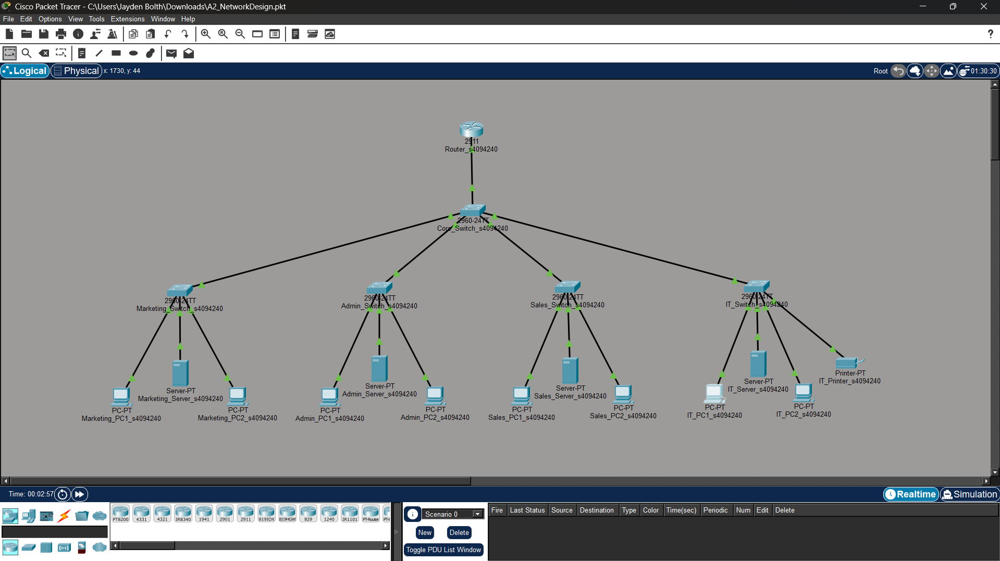
Figure 1

VLAN Segmentation: \
VLAN segmentation is the basis of the subnet design. It separates each department into their own broadcast domain for improved security, performance, and network management. Separate VLANs reduce unnecessary broadcast traffic between departments and restrict direct Layer 2 communication, helping to isolate departmental resources and minimise congestion. Trunk links between the core switch and departmental switches allows multiple VLANs to traverse the network while maintaining separation. Inter-VLAN communication is controlled through the router, allowing departments to securely access shared services such as DNS and the Sales web server when required.
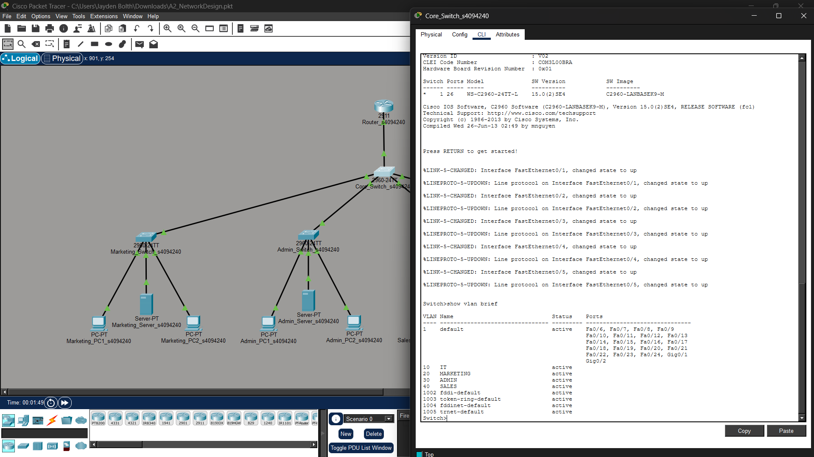
Figure 2

VLAN Demonstration: \
Successive ping responses as seen in Figure 3, confirms that network connectivity has been correctly established between devices across the network. When a device receives a reply to an ICMP ping request, it demonstrates that the source and destination devices can communicate successfully through the configured switches, VLANs, and router interfaces. The successful pings between devices in different departments verifies that IP addressing, default gateways, VLAN trunking, and inter-VLAN routing are functioning as intended. Furthermore, the populated ARP table on the router further confirms that devices across multiple subnets have been discovered and are actively communicating within the network.

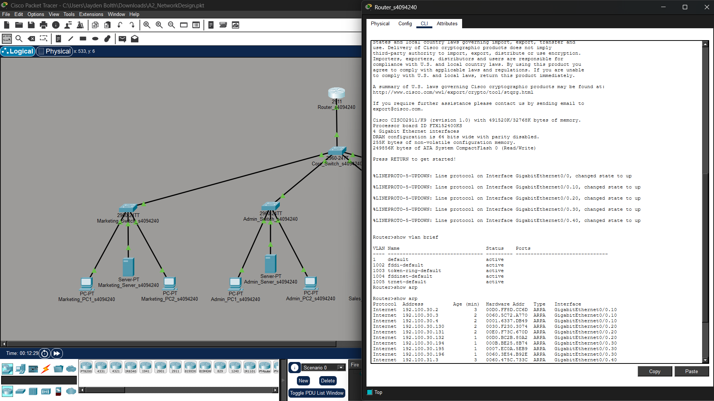
Figure 3 \

### 2. Application Service Configuration
Sales Server Web Application: \
The Sales server was configured to host a web application using the HTTP service, which operates over TCP. The web application was built using HTML. The application was tested from a PC in another department by entering the Sales server IP address, 192.100.31.2, into the web browser. The page loaded successfully, confirming that the Sales server’s HTTP service is active and reachable across the routed network. This also verifies that TCP-based application traffic can travel between departmental VLANs through the router.
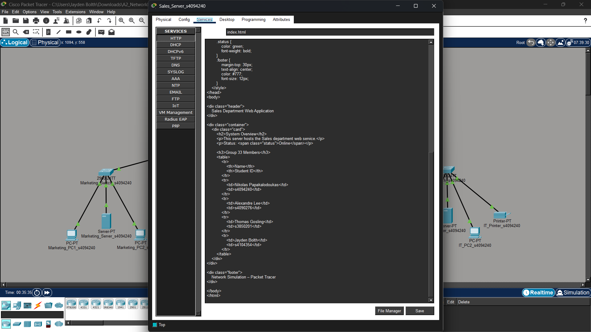
Figure 4 \
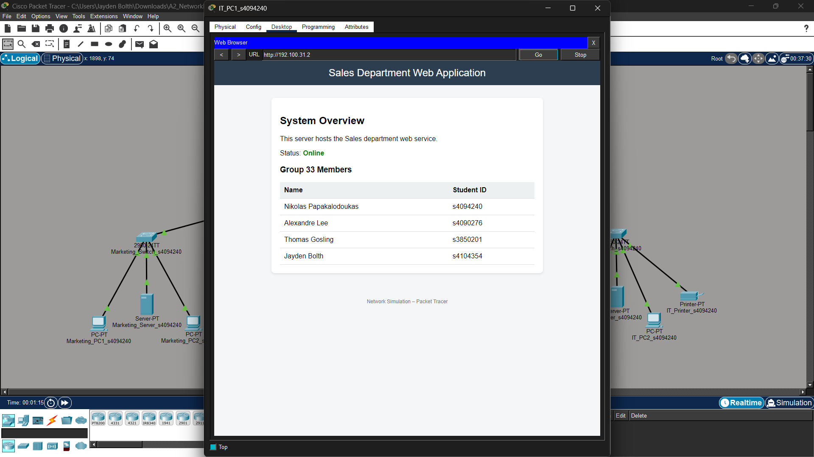
Figure 5 \

IT Server Web Application: \
The IT department server was configured to support simulated real-time communication using UDP traffic within Packet Tracer. A Complex PDU was created from a client device in the Sales department and configured to send periodic UDP packets to the IT server every one second. The configuration used destination port 53 and a custom source port to demonstrate continuous UDP packet transmission between devices across VLANs. This simulation represents the behaviour of a real-time UDP-based service by maintaining ongoing packet flow between the client and server.
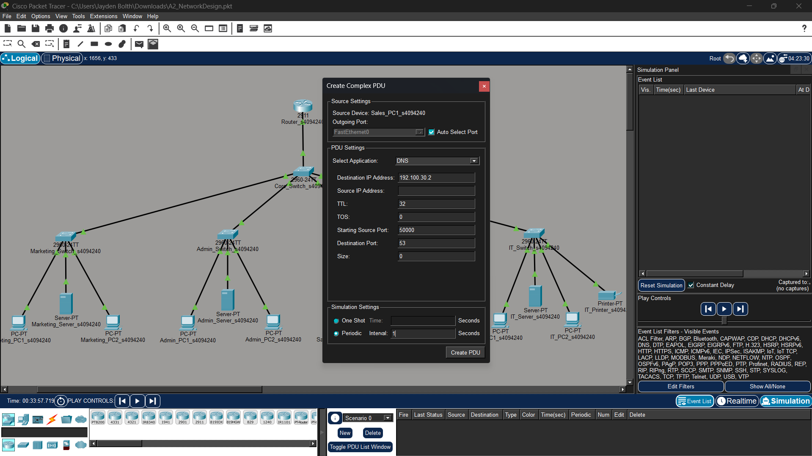
Figure 6 \

UDP Simulation: \
The UDP simulation was verified in Simulation Mode by monitoring packets arriving at the IT department server. The OSI Model view confirms UDP communication at Layer 4 using source port 50000 and destination port 53, while Layer 3 displays the source and destination IP addresses involved in the transmission. The periodic packet flow confirms that the simulated real-time UDP service is operating successfully across the VLAN-based network.
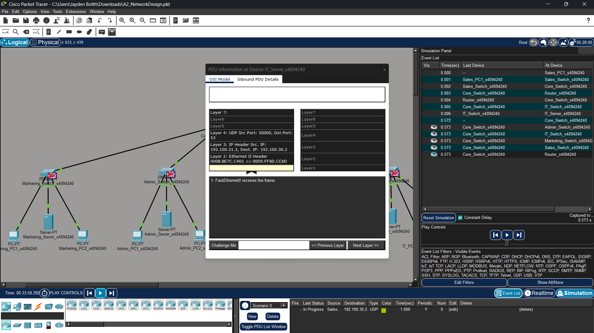
Figure 7 \

### 3. DNS Query Demonstrations
Initiating a DNS Query: 
The IT department server was configured as a DNS server by creating an A Record that mapped the domain name www.sales.com to the Sales server IP address 192.100.31.2. A client device in the Marketing department then initiated a DNS query using the domain name rather than the direct IP address. The successful ping response confirmed that the DNS service correctly resolved the domain name to the destination server. The web application hosted on the Sales server was then successfully accessed through the web browser using the configured domain name, demonstrating functional DNS resolution and inter-VLAN connectivity across the network.
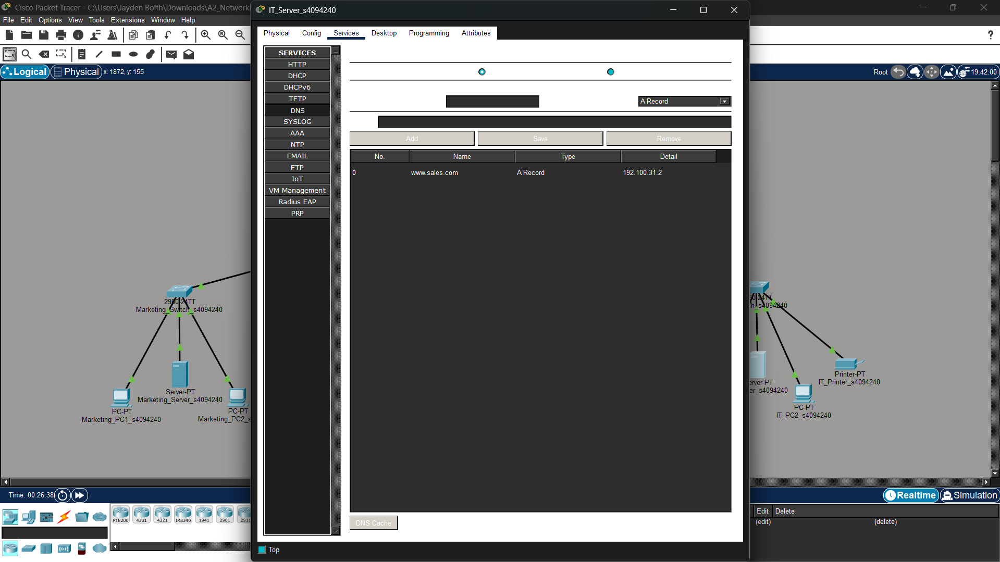
Figure 8 \
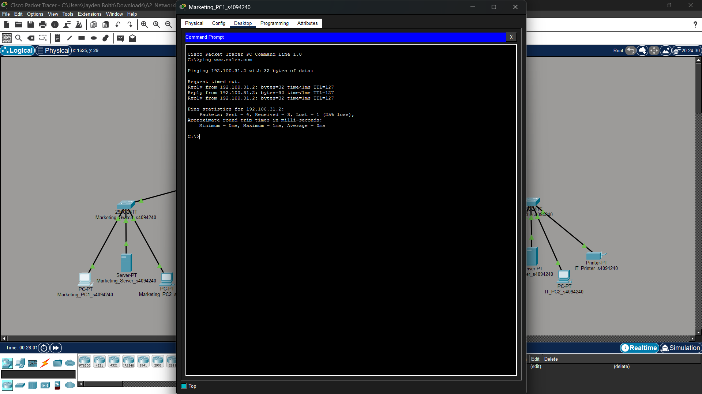
Figure 9 \
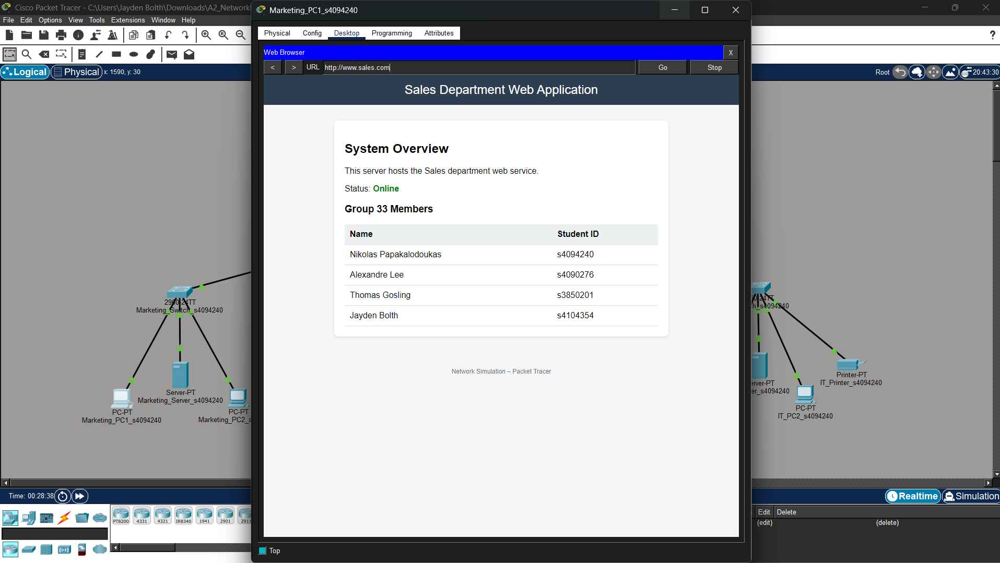
Figure 10 \

Ovserving OSI layer: \
The DNS query was monitored using Packet Tracer Simulation Mode to analyse packet flow across the OSI model. The captured packet shows DNS operating at Layer 7 and UDP communication at Layer 4 using source and destination port 53. Layer 3 displays the source and destination IP addresses involved in the DNS exchange, while Layer 2 shows the Ethernet frame and MAC address information used for local delivery. The successful DNS request and response confirm correct name resolution and communication between VLANs across the network.
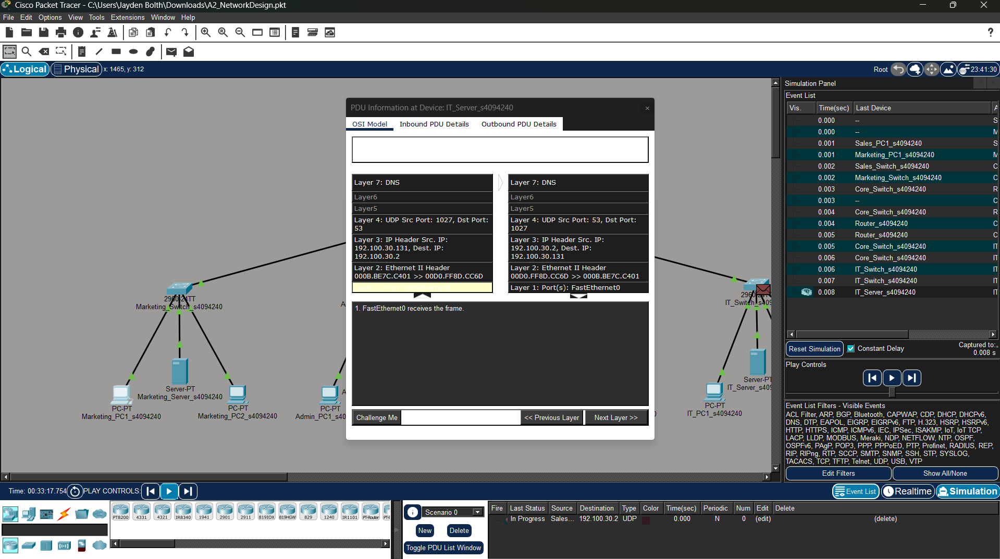
Figure 11 \

### 4. Explaining Network Design Choices:
The network topology was designed using a hierarchical structure with a central core switch, connected to the switches for each department. This approach keeps the network organised by segmenting the departments, and easier to manage and troubleshoot by limiting backbone connections to the router to one switch(central core). Each department was separated into its own VLAN to reduce unnecessary broadcast traffic and improve security by routing interdepartmental communication through the router. VLSM subnetting was utilised for efficient IP allocation according to departmental requirements, which reducrd address wastage while supporting future scalability.

A router-on-a-stick configuration was used to enable inter-VLAN communication while avoiding the need for multiple physical router interfaces. Trunk links were configured between the core switch, router, and departmental switches so that traffic from multiple VLANs could travel across a single connection efficiently.

Servers were placed within their relevant departments to reflect realistic business usage. The Sales server hosted the web application, while IT server provided DNS and simulated UDP-based services. This separation keep services organised and easier to maintain. Static IP addressing was employed so that key devices such as servers, printers, and networking equipment always remain accessible at known addresses.

The overall design improves scalability as the modular nature of the network, with its centralised switch for organisation, allows for additional departments, VLANs, or devices without overhauling the entire network or tne network becoming an unworkable spaghetti topology. To conclude, the topology provides a network that is simple, organised, secured, and allows for efficient communications.

# Task B
---

# References
###### Task A Ref
[1] https://www.omnitron-systems.com/blog/what-is-a-vlan-virtual-lan-and-how-does-it-work 
###### Task B Ref
###### Task C Ref
