# B.1 Explain FCS
**Marks:** 3 · **Tags:** theory, report

**Description:**  
Explain how the Frame Check Sequence (FCS) is used for error detection at the data link layer. List 3–5 clear steps describing how a sender computes the FCS and appends it to a frame, and how a receiver uses it to check for transmission errors. Create an original diagram illustrating the receiver's error-checking process.

**Acceptance Criteria:**
- 3 to 5 numbered steps are provided covering FCS generation and verification.
- Steps clearly distinguish the sender's role (computing and appending FCS) from the receiver's role (recomputing and comparing).
- The algorithm used (typically CRC) is identified by name.
- A diagram is included showing the receiver's error-check process with labelled inputs and outputs.
- The steps and diagram are consistent with each other.

| Points        | Criteria                                                                                           |
|---------------|----------------------------------------------------------------------------------------------------|
| 3 to >2.0    | Correct: The steps are clear, and the figure complements the step for understanding error detection. |
| 2 to >1.0    | Partial correct: The steps and the figure make sense for understanding error detection.             |
| 1 to >0      | Incorrect: Very basic information on using FCS to check an error.                                   |
| 3 pts        |                                                                                                    |

## Frame Checking Sequence Explanation
The frame check sequence is a simple error detection method where the CRC algorithm is used to validate the data integrity of the frame. The CRC algorithm takes the numeric binary value of the entire frame and divides it by a fixed binary divisor, determined by the network standard being used, appending the remainder (the FCS) to the trailer of the frame in the specific FCS field.

## FCS Error Checking and Verification Between Sender and Receiver
To differentiate between the original sender and intended recipient of the message and the sender and receiver of a frame between hops I want to make the following clarifications:
- The **original sender** and **intended recipient** refers to the person or machine that the message was originally sent from or intended to be received by.
- **Sender** and **receiver** refers to the node that sends or receives the frame in the current network hop.

I also want to clarify that in this example the **original sender's network** standard **uses** the **CRC** algorithm
### Steps
1. When the data being sent passes through the **Media Access Control (MAC)** sublayer, the **sender** adds the **MAC address** and other headers to the frame.  
2. The **original sender**'s Network Interface Card (NIC) **uses CRC** to execute **polynomial division** (XOR operations) **on** the numeric value of **the frame** (in binary) **using a fixed binary divisor** determined by the network standard (usually **32-bit CRC-32** for Ethernet and Wi-Fi). The resulting remainder (the **FCS**) is then appended to the appropriate field in the **trailer** of the frame.  
3. The **frame then hops** between nodes **on the original sender's network**. As it arrives **at each switch**, the **receiver's switch** re-executes the **CRC** on the frame, and the calculated **FCS** is validated against the trailer's value to ensure data integrity. If the values do not match, the switch detects an error; **discarding the frame and waiting for the sender to retransmit**.  
4. When the frame finally reaches the **original sender's** **router**, the **router** uses the **CRC** to validate the **FCS** once more before destroying the frame and **re-encapsulating** it to send to the **ISP** over layer 3.  
5. As the frame is transported from the **ISP** to the **intended recipient**, a **new FCS** is calculated **by the sender** at each **Layer 3** boundary (**router**) according to the network's chosen standard. Then, at each **Layer 2** boundary (**switch** or **receiver's NIC**), the **FCS** is validated **by the receiver** using **CRC** or the algorithm used by the network standard.

## Receiver Error Checking Progress Diagram

```mermaid
graph TD
    %% Define standard box styles
    classDef process fill:#1e1e1e,stroke:#61dafb,stroke-width:2px;
    classDef decision fill:#2e2e2e,stroke:#ffd700,stroke-width:2px;
    classDef terminal fill:#3c3c3c,stroke:#4caf50,stroke-width:2px,rx:10,ry:10;
    classDef error fill:#3c3c3c,stroke:#f44336,stroke-width:2px,rx:10,ry:10;

    %% --- THE FLOW --- %%

    Start([Input: Incoming Frame Bits]):::terminal
    --> Stream[Stream full frame data through CRC or Network Standard's preferred algorithm]:::process

    Stream
    --> Extract[Extract 'Calculated Remainder' from Engine]:::process

    Extract
    --> Read[Read 'Received FCS' from Frame Trailer]:::process

    Read
    --> Compare{{Does Calculated Remainder<br/>== Received FCS?}}:::decision

    %% --- DECISION OUTPUTS --- %%

    Compare -- "Yes (No Errors)" --> Accept([Output: Accept Frame<br/>Pass up to OS]):::terminal
    Compare -- "No (Error Detected)" --> Drop([Output: Discard Frame<br/>Silent Drop]):::error
```

Acceptance Criteria:
- [x] 3 to 5 numbered steps are provided covering FCS generation and verification.
- [x] Steps clearly distinguish the sender's role (computing and appending FCS) from the receiver's role (recomputing and comparing).
- [x] The algorithm used (typically CRC) is identified by name.
- [x] A diagram is included showing the receiver's error-check process with labelled inputs and outputs.
- [x] The steps and diagram are consistent with each other.
