# B.1 Explain FCS
**Marks:** 3 · **Tags:** theory, report

**Description:**  
Explain how the Frame Check Sequence (FCS) is used for error detection at the data link layer. List 3–5 clear steps describing how a sender computes the FCS and appends it to a frame, and how a receiver uses it to check for transmission errors. Create an original diagram illustrating the receiver's error-checking process.

**Acceptance Criteria:**
- 3 to 5 numbered steps are provided covering FCS generation and verification.
- Steps clearly distinguish the sender's role (computing and appending FCS) from the receiver's role (recomputing and comparing).
- The algorithm used (typically CRC) is identified by name.
- A diagram is included showing the receiver's error-check process with labelled inputs and outputs.
- The steps and diagram are consistent with each other.

| Points        | Criteria                                                                                           |
|---------------|----------------------------------------------------------------------------------------------------|
| 3 to >2.0    | Correct: The steps are clear, and the figure complements the step for understanding error detection. |
| 2 to >1.0    | Partial correct: The steps and the figure make sense for understanding error detection.             |
| 1 to >0      | Incorrect: Very basic information on using FCS to check an error.                                   |
| 3 pts        |                                                                                                    |
t n
## Frame Checking Sequence Explanation
The frame check sequence is a trailer field in a frame that is populated by an algorithm, in this case CRC, and the field value is used to validate the data integrity of the frame. The CRC algorithm takes the numeric binary value of the entire frame and divides it by a fixed binary divisor (aka Generator), determined by the network standard being used, appending the remainder (the FCS value) to the trailer of the frame in the specific FCS field. It should be noted that the fixed binary divisor have a most significant bit of 1.

The instructions for the sender to calculate the FCS with CRC and append it to the frame are as follows:
1. Append k - 1 zeroes to the data, where k is the length of the generators binary value. This will be referred to as the padded data.
2. Take the first k bits of the padded data (this will be the **sliding window**) and perform polynomial division with the generator. If the most significant bit of the result is not 1, drop the leading zeroes and append the next n bits from the padded data to the result to form the next sliding window; where n is the number of leading zeroes dropped. Repeat this process on the new sliding window until there are no more bits to append from the padded data and a new sliding window of k bits where the most significant bit is 1 cannot be formed; this is the remainder and FCS value.
3. Replace the trailing zeroes in the padded data with the k - 1 least significant bits of the remainder to produce the final frame with the FCS value added to the trailer

The steps for the receiver to validate the FCS with CRC are as follows:
1. Perform sliding window polynomial division on the frame data (as explained in step 2 of the sender instructions) using the same generator which should be used ubiquitously by all network nodes.
2. If the remainder from the polynomial division is zero then the FCS value is valid and the frame can be accepted. If the remainder is none zero, the frame is silently discarded.

## Receiver Error Checking Progress Diagram

```mermaid
graph TD
    %% Define standard box styles
    classDef process fill:#1e1e1e,stroke:#61dafb,stroke-width:2px;
    classDef decision fill:#2e2e2e,stroke:#ffd700,stroke-width:2px;
    classDef terminal fill:#3c3c3c,stroke:#4caf50,stroke-width:2px,rx:10,ry:10;
    classDef error fill:#3c3c3c,stroke:#f44336,stroke-width:2px,rx:10,ry:10;

    %% --- THE FLOW --- %%

    Start([Input: Incoming Frame Bits]):::terminal
    --> Stream[Perform polynomial division on the full frame data using the network's configured generator]:::process

    Stream
    --> Compare{{Compare: Does Calculated Remainder<br/>== 0?}}:::decision

    %% --- DECISION OUTPUTS --- %%

    Compare -- "Yes (No Errors)" --> Accept([Output: Accept Frame<br/>Pass to next node]):::terminal
    Compare -- "No (Error Detected)" --> Drop([Output: Discard Frame<br/>Silent Drop]):::error
```

Acceptance Criteria:
- [x] 3 to 5 numbered steps are provided covering FCS generation and verification.
- [x] Steps clearly distinguish the sender's role (computing and appending FCS) from the receiver's role (recomputing and comparing).
- [x] The algorithm used (typically CRC) is identified by name.
- [x] A diagram is included showing the receiver's error-check process with labelled inputs and outputs.
- [x] The steps and diagram are consistent with each other.
